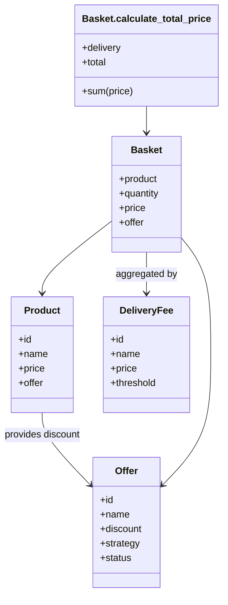

# Chart Wizard - Architecture Documentation

## Overview

Chart Wizard is a Ruby-based e-commerce shopping cart application designed with clean architecture principles, demonstrating advanced Ruby patterns and object-oriented design. The system emphasizes modularity, extensibility, and separation of concerns while maintaining simplicity and testability.

## High-Level Architecture

The application follows a layered architecture pattern with clear separation between presentation, business logic, and data persistence:

```
┌─────────────────────────────────────────────────────────────┐
│                    Presentation Layer                       │
│  ┌─────────────────────────────────────────────────────────┐│
│  │         CLI Interface (Chart::App)                      ││
│  │  • Interactive command loop                             ││
│  │  • Command parsing and routing                          ││
│  └─────────────────────────────────────────────────────────┘│
└─────────────────────────────────────────────────────────────┘
                               │
┌─────────────────────────────────────────────────────────────┐
│                   Business Logic Layer                     │
│  ┌──────────────────┐ ┌─────────────────┐ ┌─────────────────┐│
│  │     Models       │ │   Initializers  │ │    Strategies   ││
│  │  • Product       │ │  • Data Seeding │ │  • Offer Types  ││
│  │  • Basket        │ │  • System Setup │ │  • Calculations ││
│  │  • Offer         │ └─────────────────┘ └─────────────────┘│
│  │  • DeliveryFee   │                                       │
│  └──────────────────┘                                       │
└─────────────────────────────────────────────────────────────┘
                               │
┌─────────────────────────────────────────────────────────────┐
│                   Data Persistence Layer                   │
│  ┌─────────────────────────────────────────────────────────┐│
│  │              Store Modules                              ││
│  │  • In-memory storage (Base)                             ││
│  │  • Relationship management (HasOne, HasMany)            ││
│  │  • Query interface                                      ││
│  └─────────────────────────────────────────────────────────┘│
└─────────────────────────────────────────────────────────────┘
```

## Separation of Concerns

### 1. Presentation Layer
- **Responsibility**: User interface and command handling
- **Key Class**: `Chart::App`
- **Isolation**: No direct business logic, delegates to models
- **Interface**: Clean command-to-method mapping

### 2. Business Logic Layer
- **Models**: Domain entities with behavior and state
- **Initializers**: System bootstrapping and data seeding

### 3. Data Persistence Layer
- **Store Modules**: Generic persistence interface
- **Relationship Management**: Association handling (`has_one`, `has_many`)

## Model Relationships

The application's domain models are interconnected through a clean relationship structure that maintains loose coupling while enabling rich business logic:



### Data Flow Relationships

1. **Product → Offer**: One-to-one optional relationship
   - Products can have zero or one offer
   - Offers define discount strategies and amounts

2. **Basket → Product**: Many-to-one relationship
   - Each basket item references a product
   - Inherits product pricing and offer associations

3. **Basket → Offer**: Derived relationship
   - Baskets access offers through their associated product
   - Enables dynamic discount calculations

4. **Total Calculation → DeliveryFee**: Lookup relationship
   - Cart total determines applicable delivery fee
   - Threshold-based fee selection

## Dependency Injection

The system uses Ruby's module system and metaprogramming for dependency injection:

### 1. Module Extension Pattern
```ruby
class Product < Base
  extend Chart::Store::HasOne  # Injects relationship capability

  has_one :offer, Chart::Models::Offer  # Defines association
end
```

### 2. Strategy Injection
```ruby
class Offer
  def initialize(strategy:, ...)
    @strategy = strategy  # Strategy injected at runtime
  end

  def calculate_discount_for(basket)
    case @strategy
    when 'pair' then pair_strategy(basket)
    when 'fixed' then fixed_strategy(basket)
    when 'percentage' then percentage_strategy(basket)
    end
  end
end
```

### 3. Model Association Injection
```ruby
# In initializers - runtime dependency injection
product = Chart::Models::Product.select(id: offer[:product_code]).first
if product
  product.offer = offer_model  # Inject offer dependency
end
```

## Extensible Strategy Pattern - Offer Model

The offer system demonstrates a sophisticated strategy pattern implementation:

### Strategy Definition
```ruby
class Offer
  STRATEGIES = {
    'pair' => :pair_strategy,
    'fixed' => :fixed_strategy,
    'percentage' => :percentage_strategy
  }.freeze

  private

  def pair_strategy(basket)
    # Buy-one-get-one logic
    mod = basket.quantity % 2
    discount * (basket.quantity - mod) / 2
  end

  def fixed_strategy(basket)
    # Flat discount amount
    discount
  end

  def percentage_strategy(basket)
    # Proportional discount
    basket.price * (discount / 100.0)
  end
end
```

### Strategy Validation
```ruby
def validate_strategy_for?(basket)
  case @strategy
  when 'pair'
    basket.quantity >= 2  # Minimum quantity requirement
  when 'fixed', 'percentage'
    true  # Always applicable
  else
    false  # Unknown strategy
  end
end
```

### Double-Digit Precision Calculations

**Implementation Details:**
- All monetary values rounded to 2 decimal places
- Calculations performed in floating point with final rounding
- Consistent formatting for display
- Prevents floating-point precision errors

Financial calculations maintain precision throughout:

```ruby
# Price initialization with rounding
def initialize(price:)
  @price = price.to_f.round(2)
end

# Calculation precision maintenance
def calculate_price
  @price = product.price.round(2) * quantity.to_f
  # Apply discounts...
  @price = @price.round(2)  # Final rounding
end

# Display formatting
def to_s
  "$#{format('%.2f', price)}"
end
```

## Metaprogramming

The system extensively uses Ruby metaprogramming for clean, DRY code:

### 1. Dynamic Method Definition (HasOne)
```ruby
module HasOne
  def has_one(association_name, klass)
    # Getter method
    define_method(association_name) do
      instance_variable_get("@#{association_name}")
    end

    # Setter method with type checking
    define_method("#{association_name}=") do |instance|
      raise ArgumentError, "Expected #{klass}" unless instance.is_a?(klass)
      instance_variable_set("@#{association_name}", instance)
    end
  end
end
```

### 2. Dynamic Collection Methods (HasMany)
```ruby
module HasMany
  def has_many(association_name, klass)
    define_method(association_name) do
      init = []
      # Override << operator with type checking
      init.define_singleton_method(:<<) do |instance|
        raise ArgumentError, "Expected #{klass}" unless instance.is_a?(klass)
        push(instance) unless include?(instance)
      end
      instance_variable_get("@#{association_name}") || instance_variable_set("@#{association_name}", init)
    end
  end
end
```

### 3. Module Extension Hooks
```ruby
module Base
  def self.extended(base)
    base.instance_variable_set(:@store, [])  # Initialize storage
  end
end
```

### Command-Line Interface Design

Interactive CLI with robust command processing:

```ruby
# Command parsing with flexible arguments
def run(command, arg, aarg, _aaarg)
  case command
  when 'init' then init
  when 'list' then check_is_init && list(arg)
  when 'add'  then check_is_init && add(arg, aarg)
  when 'total' then check_is_init && total
  end
end

# State management
def check_is_init
  return false unless @is_init
  puts "Please initialize using init first"
end
```

The architecture demonstrates advanced Ruby techniques while maintaining simplicity and testability, making it an excellent example of clean, extensible design.
