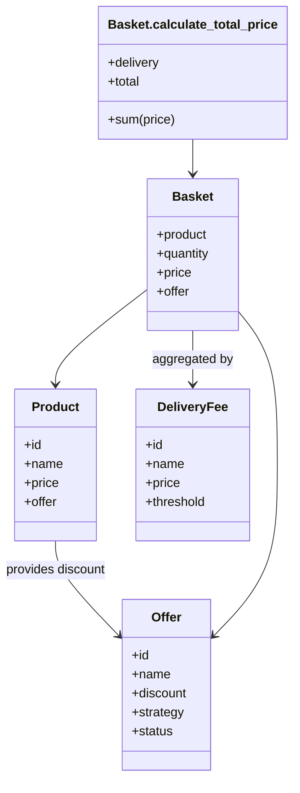

# Simple Chart Solution

Simple chart solution

# Requirements

Ruby 3.4.2

# Installation

```bash
./bin/build
```

# Architecture

See in dept at [ARCHITECTURE.md](ARCHITECTURE.md). Here's high level diagram of technical layer and data relationship.

## Technical Layer

```
┌─────────────────────────────────────────────────────────────┐
│                    Presentation Layer                       │
│  ┌─────────────────────────────────────────────────────────┐│
│  │         CLI Interface (Chart::App)                      ││
│  │  • Interactive command loop                             ││
│  │  • Command parsing and routing                          ││
│  └─────────────────────────────────────────────────────────┘│
└─────────────────────────────────────────────────────────────┘
                               │
┌─────────────────────────────────────────────────────────────┐
│                   Business Logic Layer                     │
│  ┌──────────────────┐ ┌─────────────────┐ ┌─────────────────┐│
│  │     Models       │ │   Initializers  │ │    Strategies   ││
│  │  • Product       │ │  • Data Seeding │ │  • Offer Types  ││
│  │  • Basket        │ │  • System Setup │ │  • Calculations ││
│  │  • Offer         │ └─────────────────┘ └─────────────────┘│
│  │  • DeliveryFee   │                                       │
│  └──────────────────┘                                       │
└─────────────────────────────────────────────────────────────┘
                               │
┌─────────────────────────────────────────────────────────────┐
│                   Data Persistence Layer                   │
│  ┌─────────────────────────────────────────────────────────┐│
│  │              Store Modules                              ││
│  │  • In-memory storage (Base)                             ││
│  │  • Relationship management (HasOne, HasMany)            ││
│  │  • Query interface                                      ││
│  └─────────────────────────────────────────────────────────┘│
└─────────────────────────────────────────────────────────────┘
```

## Data Relationship



# Usage

```bash
./bin/chart
<command>
```

These are the list of commands:

1. `init` - Initialize product catalogue, delivery charge rules, and offers.
2. `list <resource>` - List resources: `products`, `baskets`, `delivery_fees`, and `offers`. Use `all` to display all resources.
3. `add <product_code> <quantity>` - Add product to the chart. If you don't enter quantity, it will be assumed as 1.
4. `total` - Calculate total price of products in the chart.
